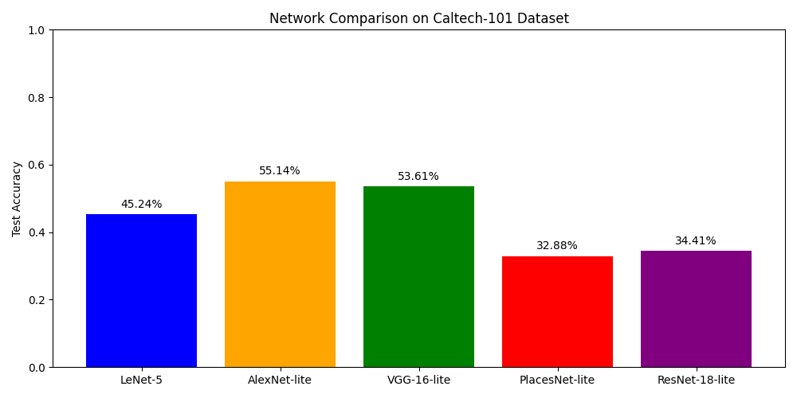
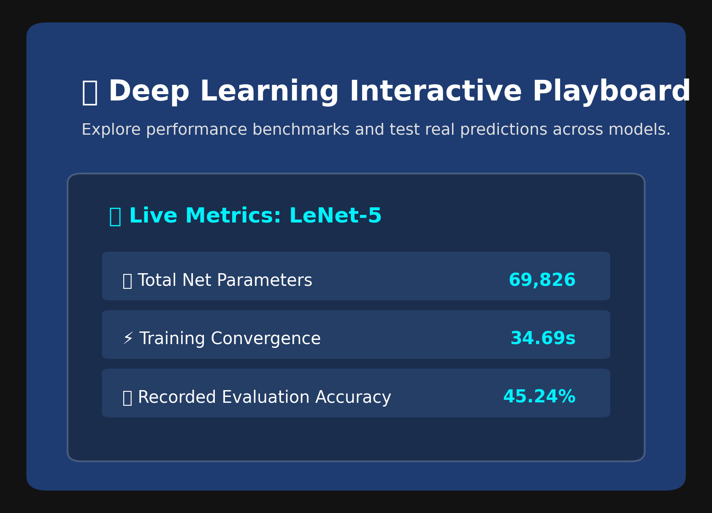

# Deep CNN Architectures on Caltech-101 with an Interactive Prediction Dashboard

## Overview
This project trains and compares five CNN architectures — **LeNet-5, AlexNet-lite, VGG-16-lite, PlacesNet-lite and ResNet-18-lite** — on the **Caltech-101** image dataset using **PyTorch**. All five networks are trained under identical conditions (same data split, same epochs, same optimizer) and compared by parameter count, training time and test accuracy. The trained weights are then loaded into an **interactive dashboard** where you can pick a model and a class, run inference on an image, and see the top-5 predictions with confidence scores.

---

## Features
- Custom dataset pipeline: Caltech-101 loaded with `ImageFolder`, resized to 32×32 and normalized
- Fixed-seed 80/20 train/test split, shared by all five models for a fair comparison
- Five lightweight architectures defined as `nn.Module` classes, including a residual network with shortcut connections
- Single shared training function (Adam, cross-entropy, 15 epochs) that records parameters, training time and test accuracy for every model
- Results table and bar chart of test accuracy per network (`comparison.png`)
- Single-image prediction helper that shows each network's predicted class and confidence
- **Interactive dashboard** (`ipywidgets`) with model and class dropdowns, a random-image inference button, live metrics and a top-5 probability chart
- Trained weights saved as `.pth` files so the dashboard runs without retraining

---

## Project Structure

```
caltech101-cnn-comparison/
│── Untitled2.ipynb              <- training and comparison notebook
│── app.ipynb                    <- interactive dashboard notebook
│── models.zip                   <- trained weights (lenet, alexnet_lite, vgg_lite, placesnet_lite, resnet_lite)
│── archive.zip                  <- Caltech-101 dataset (not included, see below)
│── comparison.png               <- accuracy comparison chart
│── dashboard_interface.png      <- dashboard screenshot
│── MCO23378_report.pdf          <- written report
│── README.md
```

After extraction the notebooks expect:

```
my_dataset/caltech-101/<class folders>
models/*.pth
```

---

## Requirements

- Python 3.x
- PyTorch
- Torchvision
- Matplotlib
- NumPy
- Pandas
- Pillow
- ipywidgets (dashboard only)

Install the required packages:

```bash
pip install torch torchvision matplotlib numpy pandas pillow ipywidgets tabulate
```

---

## How to Run

The notebooks were written for **Google Colab**, which also provides free GPU access.

### Step 1: Get the Dataset

Download Caltech-101 as `archive.zip` and place it in the root of your Google Drive (or upload it directly to `/content/`). The first cell of each notebook mounts Drive and extracts it into `my_dataset/`.

### Step 2: Train and Compare the Models

Open `Untitled2.ipynb` and run all cells. It loads the data, trains all five networks for 15 epochs, prints the results table and saves `comparison.png`. A sample prediction on a real image is shown at the end.

### Step 3: Launch the Dashboard

Upload `models.zip` to `/content/`, open `app.ipynb` and run all cells. The weights are extracted into `models/` and loaded, and the dashboard appears in the last cell.

---

## Network Architectures

All networks take a 32×32 RGB image. Only the architecture changes between runs:

| Network | Description |
|---|---|
| LeNet-5 | 2 conv + max-pool blocks (6 and 16 filters, 5×5), then FC layers 120 → 84 → classes |
| AlexNet-lite | 2 conv + max-pool blocks (16 and 32 filters, 3×3), then FC layers 128 → classes |
| VGG-16-lite | Repeated 3×3 convolution stacks with max pooling, then a small classifier |
| PlacesNet-lite | AlexNet-lite with a 365-output head (outputs are sliced to the dataset's classes at training and inference time) |
| ResNet-18-lite | Small residual network with shortcut connections and global average pooling |

---

## Training Setup

- **Dataset:** Caltech-101 (102 detected classes, including `BACKGROUND_Google`)
- **Preprocessing:** Resize to 32×32, `ToTensor`, normalize with mean and std of 0.5 per channel
- **Split:** 80% train / 20% test, fixed random seed (0)
- **Optimizer:** Adam, learning rate 1e-3
- **Loss:** Cross-entropy
- **Batch size / epochs:** 32 / 15

---

## Results

| Network | Parameters | Training Time | Test Accuracy |
|---|---|---|---|
| LeNet-5 | 69,826 | 34.69 s | 45.24% |
| AlexNet-lite | 280,518 | 79.92 s | **55.14%** |
| VGG-16-lite | 292,086 | 160.93 s | 53.61% |
| PlacesNet-lite | 314,445 | 83.36 s | 32.88% |
| ResNet-18-lite | 10,838 | 121.78 s | 34.41% |



---

## Interactive Dashboard

The dashboard lets you:

- Choose a trained network from a dropdown
- Choose a Caltech-101 class and trigger inference on a random image from it
- View the model's parameters, training time and recorded test accuracy
- See the input image and a top-5 prediction chart with confidence scores



---

## Output

The notebooks report:

- Parameter count, training time and test accuracy for each network
- A results table and the `comparison.png` bar chart
- Predicted class and confidence from every network for a sample image
- In the dashboard: live metrics, the selected image and the top-5 probability distribution

---

## Technologies Used

- Python
- PyTorch
- Torchvision
- Matplotlib / Pandas
- ipywidgets
- Google Colab

---

## Limitations and Future Work

- All images are downsized to 32×32, which removes fine detail needed to separate visually similar classes
- 102 classes are used, which is more than a typical 3–10 class lab setup, and the classes are imbalanced (some have over 600 images, others about 30)
- Each model is trained once, so results may shift with different random seeds
- Future work: data augmentation, longer training with a learning-rate scheduler, transfer learning, a confusion matrix for class-wise analysis, and uploading custom images in the dashboard

---

## Key Takeaway

The deepest or largest network is not automatically the best. **AlexNet-lite** reached the highest test accuracy (55.14%) at a moderate training cost, while **VGG-16-lite** came close (53.61%) but took roughly twice as long to train. **LeNet-5** was the fastest, and **ResNet-18-lite** was the smallest (10,838 parameters) but less accurate. Architecture performance depends on how well the design suits the dataset and training budget, not on parameter count alone.